# VSM-MCP Architecture Diagrams

## System Overview Diagram

## Variety Management Flow

## MCP Integration Architecture

```mermaid
graph TB
    subgraph "MCP Client Layer"
        subgraph "Transport Abstraction"
            STDIO[Stdio Transport]
            TCP[TCP Transport]
            WS[WebSocket Transport]
            HTTP[HTTP Transport]
        end
        
        subgraph "Connection Management"
            POOL[Connection Pool]
            DISC[Service Discovery]
            HEALTH[Health Checker]
        end
        
        subgraph "Protocol Layer"
            ENC[Message Encoder]
            DEC[Message Decoder]
            VAL[Protocol Validator]
        end
    end
    
    subgraph "MCP Server Registry"
        REG1[Official Registry]
        REG2[Community Registry]
        REG3[GitHub Registry]
    end
    
    subgraph "MCP Server Instances"
        FS[Filesystem Server]
        WEB[Web Scraper]
        DB[Database Server]
        AI[AI Assistant]
    end
    
    POOL --> STDIO
    POOL --> TCP
    POOL --> WS
    POOL --> HTTP
    
    DISC --> REG1
    DISC --> REG2
    DISC --> REG3
    
    STDIO --> FS
    TCP --> DB
    WS --> AI
    HTTP --> WEB
```

## Consciousness Interface Architecture

## Data Flow Architecture

## Module Dependency Layers

## Cybernetic Feedback Loops

## Deployment Architecture

These diagrams illustrate the complete architecture of the VSM-MCP system, showing:

1. **System Overview**: The hierarchical structure of VSM systems and their interconnections
2. **Variety Management**: The cybernetic flow of variety analysis and capability acquisition
3. **MCP Integration**: The layered architecture for protocol abstraction and server management
4. **Consciousness Interface**: The meta-cognitive components for self-awareness and learning
5. **Data Flow**: The sequence of operations for autonomous capability acquisition
6. **Module Dependencies**: The layered dependency structure of the system
7. **Cybernetic Feedback**: The multiple feedback loops maintaining system viability
8. **Deployment Architecture**: The distributed deployment model for production systems