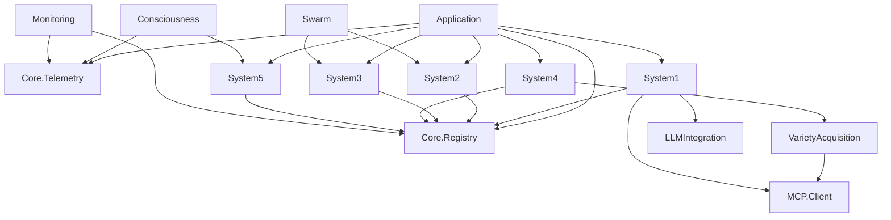

# VSM-MCP Module Architecture Design

**Version**: 2.0.0  
**Date**: 2025-01-23  
**Status**: Complete Architecture Specification  
**Author**: VSM System Designer Agent

---

## Table of Contents

1. [Executive Summary](#executive-summary)
2. [Module Hierarchy](#module-hierarchy)
3. [Core Modules](#core-modules)
4. [VSM Systems Modules](#vsm-systems-modules)
5. [Autonomous Components](#autonomous-components)
6. [MCP Integration Layers](#mcp-integration-layers)
7. [Consciousness Interface](#consciousness-interface)
8. [Module Dependencies](#module-dependencies)
9. [OTP Supervision Tree](#otp-supervision-tree)
10. [Interface Specifications](#interface-specifications)

---

## Executive Summary

The VSM-MCP system implements Stafford Beer's Viable System Model through a highly modular Elixir architecture. Each module is designed to be autonomous yet interconnected, following the cybernetic principles of variety engineering and requisite variety. The system achieves genuine autonomy through real-time variety gap analysis and dynamic capability acquisition via the Model Context Protocol.

### Key Design Principles

1. **Autonomous Operation**: Each module can operate independently while maintaining system coherence
2. **Variety Management**: Real-time calculation and management of operational vs environmental variety
3. **Cybernetic Feedback**: Continuous adaptation through multi-level feedback loops
4. **Protocol Agnostic**: Support for multiple transport mechanisms (stdio, TCP, WebSocket, HTTP)
5. **Consciousness Integration**: Meta-cognitive capabilities for self-awareness and learning

---

## Module Hierarchy

```
vsm-mcp/
├── lib/
│   ├── vsm_mcp.ex                          # Main API module
│   └── vsm_mcp/
│       ├── application.ex                  # OTP Application entry point
│       ├── core/                          # Core system components
│       ├── systems/                       # VSM Systems 1-5
│       ├── autonomous/                    # Autonomous capabilities
│       ├── mcp/                          # MCP protocol integration
│       ├── consciousness/                 # Consciousness interface
│       ├── cybernetics/                  # Variety calculation
│       ├── monitoring/                   # Health and telemetry
│       └── api/                          # External API endpoints
```

---

## Core Modules

### 1. VsmMcp.Core.Registry

**Purpose**: Central process registry and discovery service

```elixir
defmodule VsmMcp.Core.Registry do
  use GenServer
  
  @moduledoc """
  Process registry for all VSM-MCP components.
  Provides name registration, discovery, and monitoring.
  """
  
  def register(name, pid, metadata \\ %{})
  def unregister(name)
  def whereis_name(name)
  def list_by_type(type)
  def monitor_health(name)
end
```

### 2. VsmMcp.Core.Telemetry

**Purpose**: System-wide telemetry and metrics collection

```elixir
defmodule VsmMcp.Core.Telemetry do
  @moduledoc """
  Telemetry event emission and metrics collection.
  Integrates with :telemetry library for observability.
  """
  
  @events [
    [:vsm_mcp, :variety, :gap_detected],
    [:vsm_mcp, :capability, :acquired],
    [:vsm_mcp, :system, :health_check],
    [:vsm_mcp, :mcp, :connection_established]
  ]
  
  def setup_handlers()
  def emit_event(event, measurements, metadata)
  def attach_handler(event, handler_fn)
end
```

### 3. VsmMcp.Core.Message

**Purpose**: Message format and routing definitions

```elixir
defmodule VsmMcp.Core.Message do
  @moduledoc """
  Core message structure for inter-system communication.
  Implements VSM channel protocols.
  """
  
  defstruct [
    :id,
    :type,
    :source,
    :target,
    :payload,
    :metadata,
    :timestamp,
    :correlation_id
  ]
  
  def new(type, payload, opts \\ [])
  def route(message)
  def validate(message)
end
```

---

## VSM Systems Modules

### System 1: Operations

```elixir
defmodule VsmMcp.Systems.System1 do
  @moduledoc """
  Operational units performing primary activities.
  Manages MCP clients, LLM operations, and file operations.
  """
  
  defmodule Supervisor do
    use Supervisor
    
    def start_link(opts)
    def init(opts)
  end
  
  defmodule OperationalUnit do
    use GenServer
    
    def execute_operation(unit_id, operation_spec)
    def get_operational_variety(unit_id)
    def report_metrics(unit_id)
  end
  
  defmodule MCPOperations do
    def execute_mcp_request(server, request)
    def manage_mcp_connection(config)
  end
  
  defmodule LLMOperations do
    def process_llm_request(model, prompt, params)
    def manage_llm_session(session_id)
  end
  
  defmodule FileOperations do
    def read_file(path)
    def write_file(path, content)
    def watch_directory(path)
  end
end
```

### System 2: Coordination

```elixir
defmodule VsmMcp.Systems.System2 do
  @moduledoc """
  Coordination layer preventing oscillation and conflicts.
  Manages inter-unit communication and resource allocation.
  """
  
  defmodule Coordinator do
    use GenServer
    
    def coordinate_operations(operations)
    def resolve_conflicts(conflicts)
    def balance_resources(units)
  end
  
  defmodule ConflictResolver do
    def detect_conflicts(operations)
    def generate_resolution_plan(conflicts)
    def apply_resolution(plan)
  end
  
  defmodule ResourceScheduler do
    def schedule_resources(requests)
    def optimize_allocation(current_state)
  end
  
  defmodule MessageRouter do
    def route_message(message)
    def establish_channel(source, target)
  end
end
```

### System 3: Control

```elixir
defmodule VsmMcp.Systems.System3 do
  @moduledoc """
  Control system for resource optimization and audit.
  Monitors performance and ensures operational efficiency.
  """
  
  defmodule Controller do
    use GenServer
    
    def optimize_performance()
    def audit_operations()
    def allocate_resources()
  end
  
  defmodule ResourceManager do
    def monitor_resource_usage()
    def optimize_allocation()
    def enforce_limits()
  end
  
  defmodule PerformanceOptimizer do
    def analyze_bottlenecks()
    def generate_optimization_plan()
    def apply_optimizations()
  end
  
  defmodule AuditManager do
    def conduct_audit(scope)
    def generate_audit_report()
    def track_compliance()
  end
end
```

### System 4: Intelligence

```elixir
defmodule VsmMcp.Systems.System4 do
  @moduledoc """
  Intelligence system for environmental scanning and adaptation.
  Monitors external environment and predicts future states.
  """
  
  defmodule EnvironmentScanner do
    use GenServer
    
    def scan_environment()
    def analyze_trends()
    def detect_changes()
  end
  
  defmodule VarietyAnalyzer do
    def calculate_environmental_variety()
    def identify_variety_gaps()
    def recommend_acquisitions()
  end
  
  defmodule FutureModeler do
    def project_future_state(horizon)
    def simulate_scenarios()
    def assess_risks()
  end
  
  defmodule AdaptationPlanner do
    def generate_adaptation_plan(gap_analysis)
    def prioritize_capabilities()
    def trigger_acquisition()
  end
end
```

### System 5: Policy

```elixir
defmodule VsmMcp.Systems.System5 do
  @moduledoc """
  Policy system maintaining identity and strategic direction.
  Ensures system coherence and value alignment.
  """
  
  defmodule PolicyManager do
    use GenServer
    
    def evaluate_identity()
    def maintain_coherence()
    def set_strategic_direction()
  end
  
  defmodule IdentityMaintainer do
    def assess_identity_coherence()
    def update_identity_model()
    def enforce_identity_constraints()
  end
  
  defmodule ValueAligner do
    def evaluate_value_alignment()
    def adjust_priorities()
    def maintain_ethos()
  end
  
  defmodule StrategicPlanner do
    def formulate_strategy()
    def evaluate_strategic_options()
    def guide_system_evolution()
  end
end
```

---

## Autonomous Components

### Variety Acquisition Engine

```elixir
defmodule VsmMcp.Autonomous.VarietyAcquisition do
  @moduledoc """
  Autonomous capability discovery and acquisition.
  Implements cybernetic variety management.
  """
  
  defmodule Engine do
    use GenServer
    
    def analyze_variety_gap()
    def search_capabilities(requirements)
    def acquire_capability(capability_spec)
  end
  
  defmodule RegistryClient do
    def search_registries(query)
    def fetch_capability_details(id)
    def verify_compatibility(capability)
  end
  
  defmodule Installer do
    def install_mcp_server(package_spec)
    def verify_installation(server_config)
    def integrate_capability(server)
  end
  
  defmodule GapAnalyzer do
    def calculate_operational_variety()
    def measure_environmental_complexity()
    def determine_acquisition_priority()
  end
end
```

### Autonomous Swarm Coordination

```elixir
defmodule VsmMcp.Autonomous.Swarm do
  @moduledoc """
  Multi-agent swarm coordination system.
  Enables distributed intelligence and parallel processing.
  """
  
  defmodule SwarmSupervisor do
    use DynamicSupervisor
    
    def start_agent(agent_spec)
    def stop_agent(agent_id)
    def list_agents()
  end
  
  defmodule Agent do
    use GenServer
    
    def execute_task(task_spec)
    def coordinate_with(other_agents)
    def share_knowledge(knowledge)
  end
  
  defmodule Coordinator do
    def orchestrate_task(task, agents)
    def distribute_workload(workload)
    def aggregate_results(results)
  end
  
  defmodule KnowledgeBase do
    def store_knowledge(key, value)
    def retrieve_knowledge(pattern)
    def share_across_agents(knowledge)
  end
end
```

---

## MCP Integration Layers

### Transport Abstraction

```elixir
defmodule VsmMcp.MCP.Transport do
  @moduledoc """
  Transport layer abstraction for MCP protocol.
  Supports stdio, TCP, WebSocket, and HTTP.
  """
  
  @callback connect(config :: map()) :: {:ok, transport} | {:error, reason}
  @callback send_message(transport, message) :: :ok | {:error, reason}
  @callback receive_message(transport) :: {:ok, message} | {:error, reason}
  @callback close(transport) :: :ok
  
  defmodule Stdio do
    @behaviour VsmMcp.MCP.Transport
    
    def connect(config)
    def send_message(transport, message)
    def receive_message(transport)
    def close(transport)
  end
  
  defmodule TCP do
    @behaviour VsmMcp.MCP.Transport
    # Implementation
  end
  
  defmodule WebSocket do
    @behaviour VsmMcp.MCP.Transport
    # Implementation
  end
end
```

### MCP Client Implementation

```elixir
defmodule VsmMcp.MCP.Client do
  @moduledoc """
  MCP client for connecting to external MCP servers.
  Manages connection lifecycle and message exchange.
  """
  
  defmodule Connection do
    use GenServer
    
    def connect(server_config)
    def send_request(request)
    def handle_response(response)
    def disconnect()
  end
  
  defmodule Pool do
    use GenServer
    
    def get_connection(server_name)
    def add_server(server_config)
    def remove_server(server_name)
    def list_connections()
  end
  
  defmodule Protocol do
    def encode_request(method, params)
    def decode_response(response)
    def validate_message(message)
  end
end
```

### MCP Server Implementation

```elixir
defmodule VsmMcp.MCP.Server do
  @moduledoc """
  MCP server exposing VSM capabilities to external clients.
  Implements full MCP protocol specification.
  """
  
  use GenServer
  
  def start_link(config)
  def handle_request(request)
  def register_tool(tool_spec)
  def register_resource(resource_spec)
  
  defmodule ToolRegistry do
    def register(tool_module)
    def list_tools()
    def execute_tool(name, arguments)
  end
  
  defmodule ResourceRegistry do
    def register(resource_module)
    def list_resources()
    def read_resource(uri)
  end
end
```

---

## Consciousness Interface

### Meta-Cognitive System

```elixir
defmodule VsmMcp.Consciousness.Interface do
  @moduledoc """
  Consciousness interface providing self-awareness and reflection.
  Enables meta-cognitive capabilities and learning.
  """
  
  defmodule Awareness do
    use GenServer
    
    def get_current_state()
    def assess_system_health()
    def detect_anomalies()
  end
  
  defmodule Reflection do
    def reflect_on_decision(decision, outcome)
    def extract_learning_insights(experience)
    def update_decision_models(insights)
  end
  
  defmodule SelfModel do
    def get_current_model()
    def update_capabilities(new_capabilities)
    def assess_limitations()
    def track_evolution()
  end
  
  defmodule Learning do
    def learn_from_experience(experience)
    def adapt_behavior(learning)
    def share_knowledge(knowledge)
  end
end
```

### Decision Enhancement

```elixir
defmodule VsmMcp.Consciousness.Decision do
  @moduledoc """
  Decision enhancement through conscious deliberation.
  Improves decision quality through reflection and learning.
  """
  
  defmodule Deliberation do
    def evaluate_options(options, context)
    def simulate_outcomes(decision)
    def assess_confidence(decision)
  end
  
  defmodule History do
    def record_decision(decision, outcome)
    def analyze_patterns()
    def identify_biases()
  end
  
  defmodule Improvement do
    def suggest_improvements(decision_type)
    def apply_learning(new_decision)
    def measure_improvement()
  end
end
```

---

## Module Dependencies

### Dependency Graph



### Interface Dependencies

1. **System 1 → System 2**: Operational coordination requests
2. **System 2 → System 3**: Resource allocation decisions
3. **System 3 → System 4**: Performance data for analysis
4. **System 4 → System 5**: Environmental intelligence
5. **System 5 → All Systems**: Policy directives
6. **Consciousness → All Systems**: Meta-cognitive insights
7. **MCP → System 1**: External capability execution
8. **Monitoring → All Systems**: Health and metrics

---

## OTP Supervision Tree

```elixir
defmodule VsmMcp.Application do
  use Application
  
  def start(_type, _args) do
    children = [
      # Core services
      {Registry, keys: :unique, name: VsmMcp.Registry},
      VsmMcp.Core.Telemetry,
      
      # System supervisors
      VsmMcp.Systems.System5.Supervisor,
      VsmMcp.Systems.System4.Supervisor,
      VsmMcp.Systems.System3.Supervisor,
      VsmMcp.Systems.System2.Supervisor,
      VsmMcp.Systems.System1.Supervisor,
      
      # Autonomous components
      VsmMcp.Autonomous.VarietyAcquisition.Supervisor,
      VsmMcp.Autonomous.Swarm.SwarmSupervisor,
      
      # MCP services
      VsmMcp.MCP.Client.Pool,
      VsmMcp.MCP.Server,
      
      # Consciousness interface
      VsmMcp.Consciousness.Interface,
      
      # Monitoring
      VsmMcp.Monitoring.SystemHealth,
      
      # Dynamic supervisors
      {DynamicSupervisor, name: VsmMcp.ConnectionSupervisor},
      {DynamicSupervisor, name: VsmMcp.AgentSupervisor}
    ]
    
    opts = [strategy: :one_for_one, name: VsmMcp.Supervisor]
    Supervisor.start_link(children, opts)
  end
end
```

### Supervision Strategy

1. **Top-Level**: `:one_for_one` - Isolated failure handling
2. **System Supervisors**: `:rest_for_one` - Dependent system restart
3. **Dynamic Supervisors**: For runtime-spawned processes
4. **Circuit Breakers**: For external service connections
5. **Bulkheads**: Process isolation for fault containment

---

## Interface Specifications

### Inter-System Communication Protocol

```elixir
defmodule VsmMcp.Protocol.InterSystem do
  @moduledoc """
  Protocol for communication between VSM systems.
  Ensures proper variety management and feedback.
  """
  
  @type message :: %{
    type: atom(),
    source: atom(),
    target: atom(),
    payload: map(),
    correlation_id: String.t(),
    timestamp: DateTime.t()
  }
  
  @callback send_message(target :: atom(), message :: message()) :: :ok | {:error, reason}
  @callback receive_message() :: {:ok, message()} | {:error, reason}
  @callback establish_channel(target :: atom()) :: {:ok, channel} | {:error, reason}
end
```

### External API Specification

```elixir
defmodule VsmMcp.API do
  @moduledoc """
  External HTTP/WebSocket API for VSM-MCP system.
  RESTful endpoints and real-time subscriptions.
  """
  
  # Variety Management
  get "/api/v1/variety/status"
  post "/api/v1/variety/analyze"
  post "/api/v1/variety/acquire"
  
  # MCP Management
  get "/api/v1/mcp/servers"
  post "/api/v1/mcp/servers"
  delete "/api/v1/mcp/servers/:id"
  
  # System Health
  get "/api/v1/health"
  get "/api/v1/metrics"
  
  # Consciousness Interface
  get "/api/v1/consciousness/awareness"
  post "/api/v1/consciousness/reflect"
  
  # WebSocket Subscriptions
  ws "/ws/variety_updates"
  ws "/ws/system_events"
  ws "/ws/consciousness_stream"
end
```

---

## Implementation Priority

### Phase 1: Core Infrastructure
1. Core.Registry
2. Core.Telemetry
3. Application supervisor structure

### Phase 2: VSM Systems
1. System 1 (Operations)
2. System 2 (Coordination)
3. System 3 (Control)

### Phase 3: Intelligence Layer
1. System 4 (Intelligence)
2. System 5 (Policy)
3. Variety Acquisition

### Phase 4: Advanced Features
1. Consciousness Interface
2. Autonomous Swarm
3. Full MCP Integration

### Phase 5: Production Readiness
1. Monitoring and Observability
2. API Implementation
3. Performance Optimization

---

This architecture provides a complete, modular, and cybernetically-sound implementation of the Viable System Model with autonomous MCP integration capabilities.