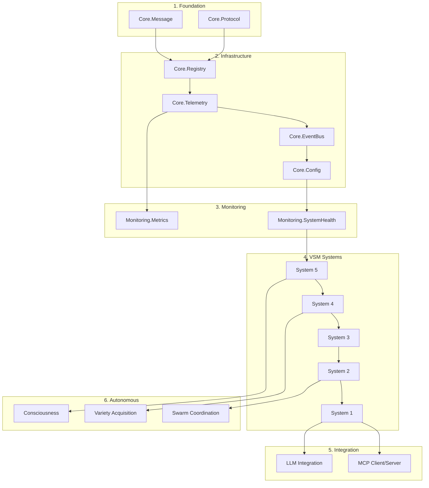

# VSM-MCP Module Dependencies and Integration Map

**Version**: 2.0.0  
**Date**: 2025-01-23  
**Status**: Complete Dependency Analysis  
**Author**: VSM System Designer Agent

---

## Table of Contents

1. [Dependency Overview](#dependency-overview)
2. [Core Dependencies](#core-dependencies)
3. [System Dependencies](#system-dependencies)
4. [Cross-System Integration](#cross-system-integration)
5. [External Dependencies](#external-dependencies)
6. [Dependency Resolution Order](#dependency-resolution-order)
7. [Circular Dependency Prevention](#circular-dependency-prevention)

---

## Dependency Overview

The VSM-MCP system follows a strict hierarchical dependency structure that mirrors Beer's recursive system organization. Dependencies flow upward from infrastructure through core services to autonomous components.

### Dependency Principles

1. **Acyclic Dependencies**: No circular dependencies between modules
2. **Interface Segregation**: Modules depend on interfaces, not implementations
3. **Dependency Inversion**: High-level modules don't depend on low-level details
4. **Stable Dependencies**: Volatile modules depend on stable modules
5. **Explicit Dependencies**: All dependencies clearly declared in module definitions

---

## Core Dependencies

### Foundation Layer

```elixir
# No dependencies - these are the foundational modules

defmodule VsmMcp.Core.Message do
  @moduledoc "Basic message structure - no dependencies"
end

defmodule VsmMcp.Core.Protocol do
  @moduledoc "Protocol definitions - no dependencies"
end
```

### Infrastructure Layer

```elixir
defmodule VsmMcp.Core.Registry do
  @moduledoc "Process registry"
  
  # OTP dependencies only
  use GenServer
end

defmodule VsmMcp.Core.Telemetry do
  @moduledoc "Telemetry infrastructure"
  
  # External dependencies
  @dependencies [
    {:telemetry, "~> 1.2"},
    {:telemetry_metrics, "~> 0.6"},
    {:telemetry_poller, "~> 1.0"}
  ]
end

defmodule VsmMcp.Core.EventBus do
  @moduledoc "Event distribution"
  
  # Internal dependencies
  alias VsmMcp.Core.Registry
  alias VsmMcp.Core.Message
  
  # External dependencies
  @dependencies [
    {:gen_stage, "~> 1.2"}
  ]
end
```

### Configuration Layer

```elixir
defmodule VsmMcp.Core.Config do
  @moduledoc "Configuration management"
  
  # Internal dependencies
  alias VsmMcp.Core.Registry
  
  # External dependencies
  @dependencies [
    {:vapor, "~> 0.10"}  # Environment configuration
  ]
end

defmodule VsmMcp.Core.Supervisor do
  @moduledoc "Core supervision tree"
  
  use Supervisor
  
  # Internal dependencies
  alias VsmMcp.Core.Registry
  alias VsmMcp.Core.Telemetry
  alias VsmMcp.Core.EventBus
end
```

---

## System Dependencies

### System 1: Operations

```elixir
defmodule VsmMcp.Systems.System1 do
  @moduledoc "Operational units"
  
  # Core dependencies
  alias VsmMcp.Core.{Registry, Telemetry, Message, EventBus}
  
  # No dependencies on other systems (autonomous operation)
  
  # Sub-module dependencies
  defmodule MCPOperations do
    alias VsmMcp.MCP.Client
    alias VsmMcp.MCP.Protocol
  end
  
  defmodule LLMOperations do
    alias VsmMcp.LLM.Client
    alias VsmMcp.LLM.Models
  end
  
  defmodule FileOperations do
    # External dependencies
    @dependencies [
      {:file_system, "~> 0.2"}  # File watching
    ]
  end
end
```

### System 2: Coordination

```elixir
defmodule VsmMcp.Systems.System2 do
  @moduledoc "Coordination layer"
  
  # Core dependencies
  alias VsmMcp.Core.{Registry, Telemetry, Message, EventBus}
  
  # Interface dependencies (not implementation)
  alias VsmMcp.Interfaces.{S1S2, S2S3}
  
  # System 1 awareness (through interface only)
  @depends_on_interfaces [:system1_operations]
  
  defmodule ConflictResolver do
    # External dependencies
    @dependencies [
      {:libgraph, "~> 0.16"}  # Dependency graph analysis
    ]
  end
  
  defmodule ResourceScheduler do
    # External dependencies
    @dependencies [
      {:quantum, "~> 3.5"}  # Cron-like scheduling
    ]
  end
end
```

### System 3: Control

```elixir
defmodule VsmMcp.Systems.System3 do
  @moduledoc "Control and optimization"
  
  # Core dependencies
  alias VsmMcp.Core.{Registry, Telemetry, Message, EventBus}
  
  # Interface dependencies
  alias VsmMcp.Interfaces.{S2S3, S3S4, S3Star}
  
  # Monitoring dependencies
  alias VsmMcp.Monitoring.{Metrics, Performance}
  
  defmodule ResourceManager do
    # External dependencies
    @dependencies [
      {:ex_rated, "~> 2.1"},  # Rate limiting
      {:poolboy, "~> 1.5"}    # Resource pooling
    ]
  end
  
  defmodule PerformanceOptimizer do
    # External dependencies
    @dependencies [
      {:statistex, "~> 1.0"}  # Statistical analysis
    ]
  end
end
```

### System 4: Intelligence

```elixir
defmodule VsmMcp.Systems.System4 do
  @moduledoc "Environmental intelligence"
  
  # Core dependencies
  alias VsmMcp.Core.{Registry, Telemetry, Message, EventBus}
  
  # Interface dependencies
  alias VsmMcp.Interfaces.{S3S4, S4S5}
  
  # Autonomous component dependencies
  alias VsmMcp.Autonomous.VarietyAcquisition
  alias VsmMcp.Cybernetics.{VarietyCalculator, ComplexityAnalyzer}
  
  defmodule EnvironmentScanner do
    # External dependencies
    @dependencies [
      {:httpoison, "~> 2.1"},   # HTTP client
      {:tesla, "~> 1.7"}        # HTTP client with middleware
    ]
  end
  
  defmodule FutureModeler do
    # External dependencies
    @dependencies [
      {:nx, "~> 0.6"},          # Numerical computing
      {:explorer, "~> 0.7"}     # Data analysis
    ]
  end
end
```

### System 5: Policy

```elixir
defmodule VsmMcp.Systems.System5 do
  @moduledoc "Policy and identity"
  
  # Core dependencies
  alias VsmMcp.Core.{Registry, Telemetry, Message, EventBus}
  
  # Interface dependencies
  alias VsmMcp.Interfaces.{S4S5}
  
  # Consciousness dependencies
  alias VsmMcp.Consciousness.{Interface, SelfModel}
  
  # No external system dependencies (top of hierarchy)
  
  defmodule IdentityMaintainer do
    # External dependencies
    @dependencies [
      {:uuid, "~> 1.1"}  # Identity generation
    ]
  end
end
```

---

## Cross-System Integration

### MCP Integration Dependencies

```elixir
defmodule VsmMcp.MCP do
  @moduledoc "MCP protocol integration"
  
  # Transport implementations
  defmodule Transport.Stdio do
    # No external deps - uses Erlang ports
  end
  
  defmodule Transport.TCP do
    # Uses :gen_tcp from OTP
  end
  
  defmodule Transport.WebSocket do
    @dependencies [
      {:websock_adapter, "~> 0.5"},
      {:mint_web_socket, "~> 1.0"}
    ]
  end
  
  defmodule Client do
    # Core dependencies
    alias VsmMcp.Core.{Registry, Telemetry}
    alias VsmMcp.MCP.{Transport, Protocol}
    
    @dependencies [
      {:jason, "~> 1.4"}  # JSON encoding/decoding
    ]
  end
  
  defmodule Server do
    # Core dependencies
    alias VsmMcp.Core.{Registry, Telemetry}
    alias VsmMcp.Systems.System1  # Exposes System 1 capabilities
    
    @dependencies [
      {:jason, "~> 1.4"},
      {:plug, "~> 1.14"}  # HTTP server abstraction
    ]
  end
end
```

### Autonomous Components Dependencies

```elixir
defmodule VsmMcp.Autonomous.VarietyAcquisition do
  @moduledoc "Autonomous capability acquisition"
  
  # Core dependencies
  alias VsmMcp.Core.{Registry, Telemetry, EventBus}
  
  # System dependencies (through interfaces)
  alias VsmMcp.Interfaces.S4S5  # Reports to System 4
  alias VsmMcp.Systems.System1  # Integrates new capabilities
  
  # MCP dependencies
  alias VsmMcp.MCP.{Client, Discovery}
  
  # Cybernetics dependencies
  alias VsmMcp.Cybernetics.{VarietyCalculator, GapAnalyzer}
  
  defmodule Installer do
    @dependencies [
      {:temp, "~> 0.4"}  # Temporary directories
    ]
  end
end

defmodule VsmMcp.Autonomous.Swarm do
  @moduledoc "Multi-agent coordination"
  
  # Core dependencies
  alias VsmMcp.Core.{Registry, Telemetry, EventBus}
  
  # System dependencies
  alias VsmMcp.Systems.System2  # Coordination
  alias VsmMcp.Systems.System3  # Resource management
  
  @dependencies [
    {:horde, "~> 0.8"}  # Distributed process registry
  ]
end
```

### Consciousness Dependencies

```elixir
defmodule VsmMcp.Consciousness do
  @moduledoc "Meta-cognitive capabilities"
  
  # Core dependencies
  alias VsmMcp.Core.{Registry, Telemetry, EventBus}
  
  # System dependencies
  alias VsmMcp.Systems.System5  # Reports to policy level
  
  # Monitoring dependencies
  alias VsmMcp.Monitoring.SystemHealth
  
  defmodule Learning do
    @dependencies [
      {:exla, "~> 0.6"},     # Elixir XLA bindings
      {:bumblebee, "~> 0.4"} # Pre-trained models
    ]
  end
end
```

---

## External Dependencies

### Production Dependencies

```elixir
defp deps do
  [
    # Core OTP/Elixir
    {:elixir, "~> 1.16"},
    
    # JSON handling
    {:jason, "~> 1.4"},
    
    # HTTP clients
    {:httpoison, "~> 2.1"},
    {:tesla, "~> 1.7"},
    {:finch, "~> 0.16"},
    
    # WebSocket
    {:websock_adapter, "~> 0.5"},
    
    # Telemetry & Monitoring
    {:telemetry, "~> 1.2"},
    {:telemetry_metrics, "~> 0.6"},
    {:telemetry_poller, "~> 1.0"},
    
    # Process management
    {:poolboy, "~> 1.5"},
    {:gen_stage, "~> 1.2"},
    {:flow, "~> 1.2"},
    
    # Distributed systems
    {:horde, "~> 0.8"},
    {:libcluster, "~> 3.3"},
    
    # Data processing
    {:nx, "~> 0.6"},
    {:explorer, "~> 0.7"},
    {:exla, "~> 0.6", optional: true},
    
    # Utilities
    {:vapor, "~> 0.10"},
    {:uuid, "~> 1.1"},
    {:temp, "~> 0.4"},
    
    # Scheduling
    {:quantum, "~> 3.5"},
    
    # Graph algorithms
    {:libgraph, "~> 0.16"}
  ]
end
```

### Development Dependencies

```elixir
defp deps(:dev) do
  [
    {:dialyxir, "~> 1.4", only: [:dev], runtime: false},
    {:credo, "~> 1.7", only: [:dev, :test], runtime: false},
    {:ex_doc, "~> 0.30", only: :dev, runtime: false},
    {:mix_test_watch, "~> 1.1", only: :dev, runtime: false}
  ]
end
```

### Test Dependencies

```elixir
defp deps(:test) do
  [
    {:mock, "~> 0.3.8", only: :test},
    {:stream_data, "~> 0.6", only: [:dev, :test]},
    {:benchee, "~> 1.1", only: [:dev, :test]}
  ]
end
```

---

## Dependency Resolution Order

### Startup Order



---

## Circular Dependency Prevention

### Design Patterns

1. **Interface Segregation**
   ```elixir
   # Instead of direct module dependencies
   # BAD:
   alias VsmMcp.Systems.System1
   
   # GOOD:
   alias VsmMcp.Interfaces.S1S2
   ```

2. **Event-Based Decoupling**
   ```elixir
   # Instead of direct function calls
   # BAD:
   System3.notify_system4(data)
   
   # GOOD:
   EventBus.emit(:system3_update, data)
   ```

3. **Registry-Based Discovery**
   ```elixir
   # Instead of hardcoded references
   # BAD:
   GenServer.call(VsmMcp.Systems.System1, :get_status)
   
   # GOOD:
   {:ok, pid} = Registry.lookup(:system1)
   GenServer.call(pid, :get_status)
   ```

### Dependency Rules

1. **Systems 1-5**: Can only depend on Core modules and Interfaces
2. **Core Modules**: Cannot depend on Systems or Autonomous components
3. **Autonomous Components**: Can depend on Interfaces but not System implementations
4. **External Integrations**: Must go through defined interfaces
5. **Consciousness**: Can observe all systems but only influences through System 5

---

This dependency map ensures the VSM-MCP system maintains clean architecture with clear separation of concerns and no circular dependencies.